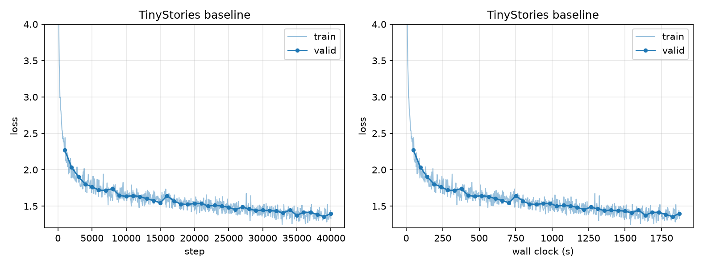
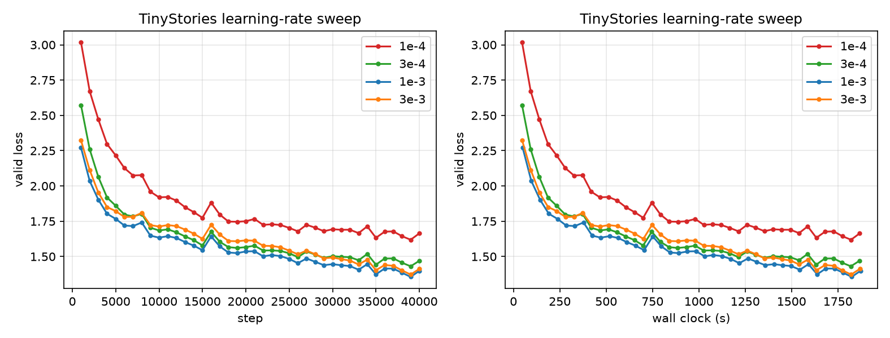
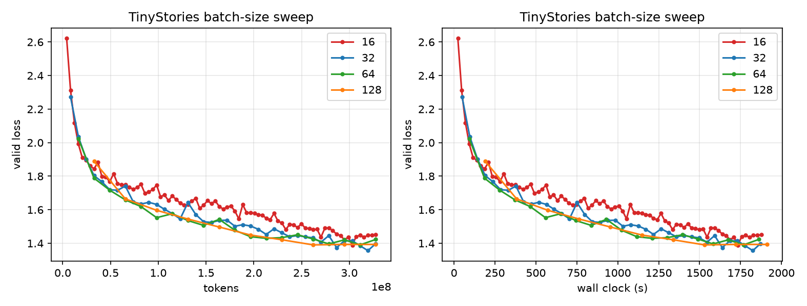
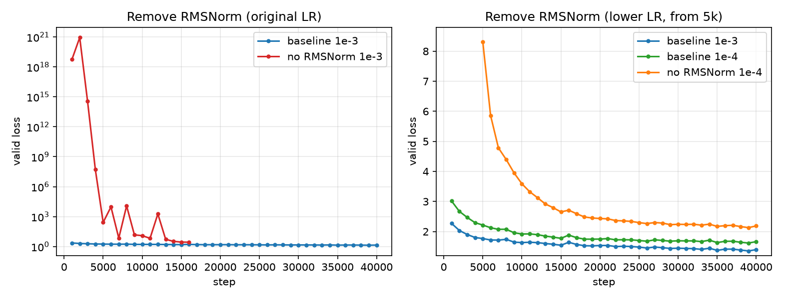
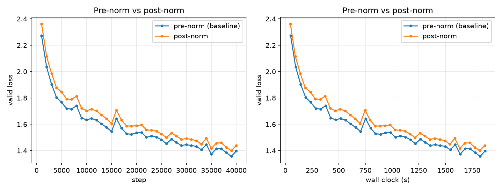
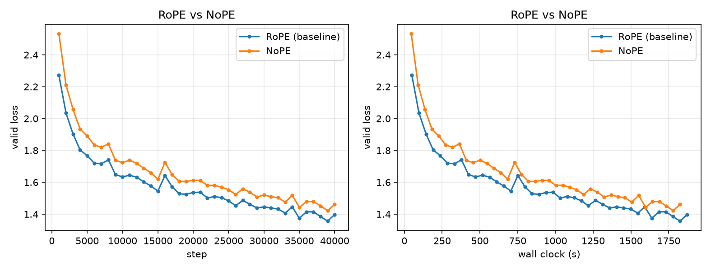
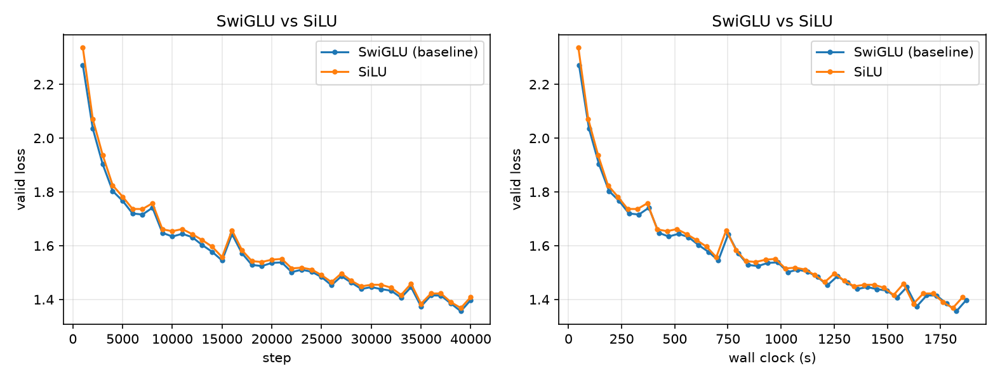
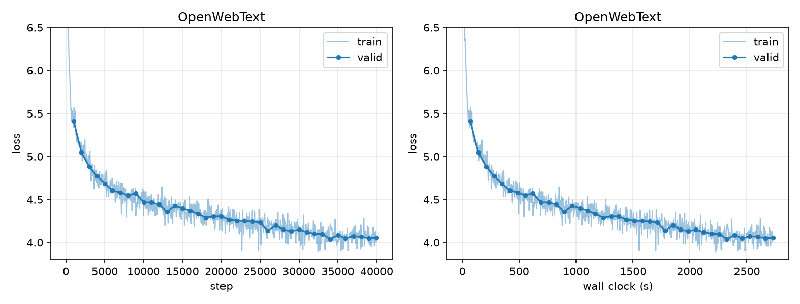

# CS336 Assignment 1 Writeup（草稿）

> 作业1（Basics）书面题草稿。每题先附题干，再写回答。最终提交需排版为 `writeup.pdf`（课程通常用英文；本稿先用中文）。
>
> 其他作业的笔记见 `notes/assignment2/` 等目录。

## 2 Byte-Pair Encoding (BPE) Tokenizer

### unicode1：Understanding Unicode（1 分）

#### 题干

**(a)** What Unicode character does `chr(0)` return?  
Deliverable: A one-sentence response.

**(b)** How does this character’s string representation (`__repr__()`) differ from its printed representation?  
Deliverable: A one-sentence response.

**(c)** What happens when this character occurs in text? It may be helpful to play around with the following in your Python interpreter:

```python
>>> chr(0)
>>> print(chr(0))
>>> "this is a test" + chr(0) + "string"
>>> print("this is a test" + chr(0) + "string")
```

Deliverable: A one-sentence response.

#### 回答

**(a)** `chr(0)` 返回 Unicode 空字符（null character，码点 U+0000），在 Python
中通常用转义形式 `\x00` 表示。

**(b)** `repr(chr(0))` 会显示可见的转义字符串 `'\x00'`，而 `print(chr(0))`
会直接写出 NUL 控制字符，终端通常不显示任何可见符号。

**(c)** NUL 不会终止 Python 字符串：拼接后字符串仍包含它且 `len` 会计数，但
`print("this is a test" + chr(0) + "string")` 中间的 NUL 通常不可见，所以视觉上
可能像是两段文字直接相连。

---


### unicode2：Unicode Encodings（3 分）


#### 题干

**(a)** What are some reasons to prefer training our tokenizer on UTF-8 encoded bytes, rather than UTF-16 or UTF-32? It may be helpful to compare the output of these encodings for various input strings.  
Deliverable: A one-to-two sentence response.

**(b)** Consider the following (incorrect) function, which is intended to decode a UTF-8 byte string into a Unicode string. Why is this function incorrect? Provide an example of an input byte string that yields incorrect results.

```python
def decode_utf8_bytes_to_str_wrong(bytestring: bytes):
    return "".join([bytes([b]).decode("utf-8") for b in bytestring])

>>> decode_utf8_bytes_to_str_wrong("hello".encode("utf-8"))
'hello'
```

Deliverable: An example input byte string for which `decode_utf8_bytes_to_str_wrong` produces incorrect output, with a one-sentence explanation of why the function is incorrect.

**(c)** Give a two-byte sequence that does not decode to any Unicode character(s).  
Deliverable: An example, with a one-sentence explanation.

#### 回答

**(a)** UTF-8 对 ASCII 字符只需 1 个字节，而 UTF-16 和 UTF-32 通常分别需要
2 和 4 个字节；例如 `"hello! こんにちは!"` 的编码长度分别是 UTF-8 **23**、
UTF-16-LE **26**、UTF-32-LE **52** bytes（不计 BOM）。UTF-8 还是互联网的主流编码，并且只需固定的
256 个单字节基本符号即可覆盖所有 Unicode 输入。

**(b)** 示例输入：`"牛".encode("utf-8")`（即 `b'\xe7\x89\x9b'`）；该函数把一个
多字节 UTF-8 序列拆成三个单字节分别解码，首字节和续字节都不是独立的合法字符，
因此会抛出 `UnicodeDecodeError` 而不是返回 `"牛"`。

**(c)** 示例：`b'\xc0\x80'`。这是非法（overlong）的 UTF-8 两字节序列，调用 `.decode("utf-8")` 会抛出 `UnicodeDecodeError`。

---


### train_bpe_tinystories / train_bpe_expts_owt：BPE Training（4 分）

#### 题干

**TinyStories (a)** Train a byte-level BPE tokenizer on TinyStories with a
maximum vocabulary size of 10,000, add the `<|endoftext|>` special token, and
serialize the vocabulary and merges. Report the training time and memory, and
inspect the longest vocabulary token.

**TinyStories (b)** Profile the code and identify which part of tokenizer
training takes the most time.

**OpenWebText (a)** Train a byte-level BPE tokenizer on OpenWebText with a
maximum vocabulary size of 32,000, serialize the vocabulary and merges, and
inspect the longest vocabulary token.

**OpenWebText (b)** Compare and contrast the tokenizers trained on TinyStories
and OpenWebText.

#### 回答

本次可复现实验使用仓库中的 `tinystories_50M.txt`（50M 字符）和
`owt_5M.txt`（5M 字符）子集；完整配置、词表、merges 和训练元数据分别保存在
`assignment1-basics/experiments/artifacts/tinystories_10k/` 与
`assignment1-basics/experiments/artifacts/owt_32k/`。

**TinyStories (a)** 使用 10,000 词表（包含 `<|endoftext|>`，以及数据管线使用的
`<|pad|>`）训练耗时约 **31.5 秒**；最长 token 是长度 **17** 的
`" enthusiastically"`，是一个带前导空格的完整英文单词，符合 TinyStories
中高频、简单英文叙事文本的分布。训练过程没有单独采集峰值 RSS，但远低于题目
要求的 30GB 内存上限。

**TinyStories (b)** 优化后的训练流程中，预分词只需遍历语料一次；主要耗时来自
BPE merge 循环中维护 pair 频数、反向索引并不断更新受影响的 pre-token。使用
`pair_to_words` 和最大频数堆后，每轮只处理包含当前 pair 的词，避免重新扫描整个
词表，因而显著降低了训练时间。实测预分词约耗时 6.2 秒（50M 子集），而总训练
耗时为 31.5 秒，因此 merge 迭代是主要瓶颈。

**OpenWebText (a)** 使用 32,000 词表训练耗时约 **389.4 秒（6.5 分钟）**；最长
token 长度为 **51**，内容是一个重复出现的长数字串
`100000000000000088817841970012523233890533447265625`。它不是自然语言词，
但在网页语料中某些数字串会高频重复，因此被 BPE 合并成较长 token 是合理的。

**OpenWebText (b)** TinyStories tokenizer 更偏向儿童故事中的常见英文词和短句；
OpenWebText tokenizer 的词表更大，覆盖网页中的数字、代码、URL、多语言和各种
格式，因此能学习到更多长而专门化的 token。相应地，两个 tokenizer 的 merge
规则取决于训练语料分布，不能简单认为较大的词表在所有领域都更优。

---

### tokenizer_experiments：Experiments with tokenizers（4 分）

#### 题干

**(a)** Sample 10 documents from TinyStories and OpenWebText. Using the
previously-trained TinyStories (10K) and OpenWebText (32K) tokenizers, encode
the sampled documents into integer IDs. What is each tokenizer's compression
ratio (bytes/token)?

**(b)** What happens if you tokenize the OpenWebText sample with the TinyStories
tokenizer? Compare the compression ratio and/or qualitatively describe what
happens.

**(c)** Estimate the throughput of your tokenizer (e.g., in bytes/second). How
long would it take to tokenize the Pile dataset (825GB of text)?

**(d)** Using your TinyStories and OpenWebText tokenizers, encode the respective
training and development datasets into a sequence of integer token IDs.

#### 回答

实验使用随机种子 `42`，每个数据集抽取 10 个文档；结果保存于
`assignment1-basics/experiments/artifacts/tokenizer_experiments.json`。

**(a)** `bytes/token` 越大表示压缩效果越好。TinyStories 样本使用 TinyStories
tokenizer 时为 **4.044 bytes/token**，使用 OWT tokenizer 时为 **3.857
bytes/token**。OWT 样本使用 TinyStories tokenizer 时为 **3.588 bytes/token**，
使用 OWT tokenizer 时为 **4.323 bytes/token**。

**(b)** 在 OWT 样本上，TinyStories tokenizer 的压缩率从 OWT tokenizer 的
4.323 降到 3.588 bytes/token，即需要更多 token 表示相同字节数，压缩效果约差
17%。这符合 tokenizer 对训练语料分布有适应性：TinyStories 词表更偏向短小、
简单的儿童故事文本，而 OWT 包含更广泛的网页词汇、数字和格式。

**(c)** 将四组样本的测量合并后，TinyStories tokenizer 吞吐量约为 **3.68
MB/s**，处理 825GB Pile 预计需要 **62.25 小时（约 2.59 天）**；OWT
tokenizer 吞吐量约为 **3.04 MB/s**，预计需要 **75.33 小时（约 3.14 天）**。
该估算使用 `825,000,000,000 / throughput`，实际时间会随硬件、进程数和输入
缓存情况变化。

**(d)** 已用 TinyStories 10K 和 OWT 32K tokenizer，按 special-token 边界分块、
8 个 worker 并行编码各自的 train/valid 语料，输出 `uint16` `.npy`（可用
`np.load(..., mmap_mode="r")` 加载）。产物在
`assignment1-basics/data/tokenized/`，摘要在同目录 `meta.json`。

| 文件                    |        tokens | max_id | bytes/token |   耗时 |       吞吐 |
| ----------------------- | ------------: | -----: | ----------: | -----: | ---------: |
| `tinystories_train.npy` |   540,980,844 |   9999 |       4.118 |  43.1s | 51.68 MB/s |
| `tinystories_valid.npy` |     5,463,342 |   9999 |       4.119 |   0.4s | 55.42 MB/s |
| `owt_train.npy`         | 2,793,355,176 |  31999 |       4.267 | 238.0s | 50.09 MB/s |
| `owt_valid.npy`         |    68,041,541 |  31999 |       4.262 |   5.6s | 51.53 MB/s |

`max_id` 分别落在 10K / 32K 词表范围内，确认使用的是本题要求的 artifact，
而不是此前 32,768 词表。全量压缩率与 10 文档样本（TinyStories 4.044、OWT
4.323 bytes/token）接近，说明样本估算没有系统性偏差。并行编码吞吐约
50–55 MB/s，明显高于 (c) 中单进程小样本测得的 3–4 MB/s。

---

## 3 Transformer Language Model

> 实现题见 `assignment1-basics/` 代码。此处只收录书面题。题干以课程讲义为准；若与本地 `cs336_assignment1_basics.pdf` 有出入，以 PDF 为准。


### transformer_accounting：Transformer LM resource accounting（5 分）


#### 题干

大部分 Transformer 的浮点运算来自矩阵乘。对 $A \in \mathbb{R}^{m \times n}$、$B \in \mathbb{R}^{n \times p}$，乘积 $AB$ 计 **$2mnp$ FLOPs**。下面的模型指 **本作业实现的架构**（SwiGLU、RMSNorm、RoPE、无 bias），不是 HuggingFace 的 GPT-2 原版。

**(a)** Consider GPT-2 XL, which has the following configuration:

- `vocab_size`: 50,257
- `context_length`: 1,024
- `num_layers`: 48
- `d_model`: 1,600
- `num_heads`: 25
- `d_ff`: 4,288

Suppose we constructed our model using this configuration. How many trainable parameters would our model have? Assuming each parameter is represented using single-precision floating point, how much memory is required to just load this model?

Deliverable: The number of trainable parameters, and the memory required to load the model.

**(b)** Identify the matrix multiplies required to complete a forward pass of our GPT-2 XL-shaped model. How many FLOPs do these matrix multiplies require in total? Assume that our input sequence has `context_length` tokens.

Deliverable: A list of the matrix multiplies, and the total number of FLOPs.

**(c)** Based on your analysis above, which parts of the model require the most FLOPs?

Deliverable: A one-to-two sentence response.

**(d)** Repeat your analysis with GPT-2 small (12 layers, 768 `d_model`, 12 heads), GPT-2 medium (24 layers, 1024 `d_model`, 16 heads), and GPT-2 large (36 layers, 1280 `d_model`, 20 heads). As the model size increases, which parts of the Transformer LM take up proportionally more or less of the total FLOPs?

For each model, provide a breakdown of model components and its associated FLOPs (as a proportion of the total FLOPs required for a forward pass). In addition, provide a one-to-two sentence description of how varying the model size changes the proportional FLOPs of each component.

Deliverable: A table (or equivalent) of FLOP proportions by component for each model size, plus a short description of the trend.

**(e)** Take the GPT-2 XL-shaped model and increase `context_length` to 16,384. How do the FLOPs of the various components change? Which parts of the model take up proportionally more or less of the total FLOPs?

Deliverable: A description of how component FLOPs (and their proportions) change at the longer context length.

#### 回答

**(a)**

参数量由 token embedding、每层的 MHA/FFN/两个 RMSNorm、最终 RMSNorm 和
lm head 组成。由于 RoPE 没有可训练参数、Linear 没有 bias，

$$
\begin{aligned}
P &= 2(V D) + L(4D^2 + 3D d_{ff} + 2D) + D \\
  &= 2(50257)(1600) + 48(4\cdot1600^2 + 3\cdot1600\cdot4288 + 2\cdot1600) + 1600 \\
  &= 1,640,452,800 \text{ parameters}.
\end{aligned}
$$

float32 每个参数占 4 bytes，因此仅加载模型参数需要
**6,561,811,200 bytes（约 6.56 GB，6.11 GiB）**。

**(b)**

设输入序列长度为 `T=1024`。每层 MHA 的矩阵乘包括 Q/K/V 三个投影、
`QKᵀ`、注意力加权求和以及输出投影：

$$
F_{MHA,layer}=8TD^2+4T^2D=27.6824\text{ GFLOPs}.
$$

SwiGLU 的三个线性层需要

$$
F_{FFN,layer}=6TDd_{ff}=42.1528\text{ GFLOPs}.
$$

因此 48 层 block 共需 `48 × (27.6824 + 42.1528) = 3352.0878 GFLOPs`。
最后的 lm head 需要
`2TDV = 164.6821 GFLOPs`，总前向计算量为
**3516.7699 GFLOPs（约 3.5168 TFLOPs）**。

**(c)** FFN 层占了最多的 FLOPs，约为 **57.53%**；MHA 约占 37.78%，lm head
约占 4.68%。

**(d)** 

在 `context_length=1024`、`vocab_size=50257` 下，各模型的矩阵乘 FLOPs 如下；
MHA 已包含 QKV/output 投影和两次 attention 矩阵乘。

| Model       | num_layers | d_model | num_heads | d_ff | MHA FLOPs | FFN FLOPs | lm_head FLOPs |
| ----------- | ---------- | ------- | --------- | ---- | --------- | --------- | ------------- |
| GPT2-small  | 12         | 768     | 12        | 2048 | 96.6368   | 115.9641  | 79.0474       |
| GPT2-medium | 24         | 1024    | 16        | 2752 | 309.2376  | 415.5381  | 105.3966      |
| GPT2-large  | 36         | 1280    | 20        | 3392 | 676.4573  | 960.3278  | 131.7457      |
| GPT2-XL     | 48         | 1600    | 25        | 4288 | 1328.7555 | 2023.3322 | 164.6821      |


各模块占比如下：
| Model       | Total FLOPs | MHA    | FFN    | lm_head |
| ----------- | ----------- | ------ | ------ | ------- |
| GPT2-small  | 291.6483    | 33.13% | 39.76% | 27.10%  |
| GPT2-medium | 830.1723    | 37.25% | 50.05% | 12.70%  |
| GPT2-large  | 1768.5309   | 38.25% | 54.30% | 7.45%   |
| GPT2-XL     | 3516.7699   | 37.78% | 57.53% | 4.68%   |


随着模型参数增加，不同模块FLOPs趋势如下：

- FFN：约 39.76% → 57.53%，随着 `d_model` 和层数增加，份额持续上升。
- lm_head：约 27.10% → 4.68%，因为词表大小固定，其比例下降最明显。
- MHA：约 33.13% → 37.78%，比例略升后趋于稳定。

**(e)**

将 GPT-2 XL 的 `T` 从 1024 增大到 16,384（16 倍）时，逐 token 的投影、FFN
和 lm head FLOPs 都乘以 16，而 `QKᵀ` 与 attention 加权求和乘以 `16²=256`。
具体结果如下：

| Component | FLOPs at `T=16,384` |  Share |
| --------- | ------------------: | -----: |
| MHA       |      98.5695 TFLOPs | 73.79% |
| FFN       |      32.3733 TFLOPs | 24.24% |
| lm_head   |       2.6349 TFLOPs |  1.97% |
| Total     |     133.5777 TFLOPs |   100% |

因此长上下文下 attention 的二次复杂度成为主要成本；FFN 和 lm head 虽然也增加
16 倍，但在总 FLOPs 中的比例明显下降。

---

## 4 Training a Transformer LM

### learning_rate_tuning：Tuning the learning rate（1 分）

#### 题干

Run the toy SGD example with learning rates `1e1`, `1e2`, and `1e3` for 10
training iterations. Compare the loss behavior with the baseline learning rate
`1`: does it decay faster, decay slower, or diverge?

#### 回答

实验脚本为 `assignment1-basics/experiments/learning_rate_tuning.py`，使用固定随机
种子 `0`、相同初始权重和 10 次更新；完整 loss 序列保存于
`assignment1-basics/experiments/artifacts/learning_rate_tuning.json`。

| learning rate | iteration 1 loss | iteration 10 loss | 行为             |
| ------------: | ---------------: | ----------------: | ---------------- |
|           `1` |          26.2714 |           21.7399 | 缓慢下降         |
|          `10` |          26.2714 |           3.53075 | 快速下降         |
|         `100` |          26.2714 |      2.3499×10⁻²³ | 先振荡后快速下降 |
|        `1000` |          26.2714 |      2.43501×10¹⁸ | 发散             |

增大学习率在稳定范围内可以加快收敛，但超过稳定范围后会导致更新过大、loss
迅速增长。

---

### adamw_accounting：Resource accounting for training with AdamW（2 分）

#### 题干

Assume we are using float32 for every tensor.

**(a)** How much peak memory does running AdamW require? Decompose your answer based on the memory usage of the parameters, activations, gradients, and optimizer state. Express your answer in terms of the `batch_size` and the model hyperparameters (`vocab_size`, `context_length`, `num_layers`, `d_model`, `num_heads`). Assume `d_ff = (8/3) × d_model`.

For simplicity, when calculating memory usage of activations, consider only the components listed in the handout (Transformer block internals, final RMSNorm, output embedding, cross-entropy on logits).

Deliverable: A peak-memory expression decomposed into parameters / activations / gradients / optimizer state.

**(b)** Instantiate your answer for a GPT-2 XL-shaped model (with **this assignment’s architecture**, not the original HuggingFace GPT-2) to get an expression that only depends on `batch_size`. What is the maximum batch size you can use and still fit within 80GB memory?

Deliverable: An expression of the form \(a \cdot \text{batch\_size} + b\), and the maximum batch size.

**(c)** How many FLOPs does running one step of AdamW take?

Deliverable: A FLOP count (or a tight estimate) with a brief justification.

**(d)** Model FLOPs utilization (MFU) is the ratio of observed throughput (in FLOP/s) to the hardware’s theoretical peak FLOP throughput. An NVIDIA H100 has a theoretical peak of 495 teraFLOP/s for float32 (TF32). Assuming 50% MFU, how long would it take to train a GPT-2 XL-shaped model for 400K steps with batch size 1024 on a single H100? Assume the backward pass has twice the FLOPs of the forward pass.

Deliverable: The number of hours, with a brief justification.

> 题干以 `cs336_assignment1_basics.pdf` 为准；若 PDF 里激活列表或 `d_ff` 假设与上文不完全一致，以 PDF 为准。

#### 回答

令 `b = batch_size`、`V = vocab_size`、`T = context_length`、
`L = num_layers`、`D = d_model`、`H = num_heads`，并按题目取
`d_ff = (8/3)D`。定义参数总数（以 float32 元素计）为

$$
P = 2VD + L(4D^2 + 3Dd_{ff} + 2D) + D
  = 2VD + L(12D^2 + 2D) + D.
$$

**(a)** 参数占用 `4P` bytes，梯度占用 `4P` bytes，AdamW 的一阶和二阶矩占用
`8P` bytes。按题目列出的中间张量计数，Transformer block 的激活元素数为
`(8bTD + 2bHT² + 4bTd_ff + bTD)`，因此总激活元素数为

$$
A = L\left(\frac{56}{3}bTD + 2bHT^2\right) + bTD + bTV.
$$

所以峰值显存表达式为

$$
\text{Memory}_{\text{peak}} = 16P + 4A \quad \text{bytes}.
$$

这里的 `16P` 来自参数、梯度和两个 AdamW 状态张量；激活项 `4A` 随 batch size
线性增长。

**(b)** 对 GPT-2 XL-shaped 配置 `V=50257`、`T=1024`、`L=48`、`D=1600`、
`H=25`，得到

$$
P = 1,635,537,600,
$$

以及

$$
\text{Memory}_{\text{peak}}(b)
 = 16,150,761,472b + 26,168,601,600\ \text{bytes}
 = 15.0416b + 24.3714\ \text{GiB}.
$$

在 80GB（无论按十进制 GB 或二进制 GiB 近似）限制下，最大整数 batch size
为 **3**；`b=4` 时约需 84.5 GiB，超出限制。

**(c)** 设参数量为 `P`。忽略少量标量 bias-correction 运算，每个参数的一次
AdamW 更新约包含：权重衰减 2 FLOPs、一阶矩 3 FLOPs、二阶矩 4 FLOPs，以及
归一化更新 5 FLOPs。因此

$$
\text{FLOPs}_{\text{AdamW step}} \approx 14P
 = 22,897,526,400 \approx 22.9\ \text{GFLOPs}.
$$

不同 fused kernel 对加法、乘法和开方的计数约定可能略有差异，但该数量级远小于
一次 GPT-2 XL 前向和反向传播的计算量。

**(d)** GPT-2 XL 在 `T=1024` 时单条序列前向约需 `3.5168 TFLOPs`。按题目假设，
一次训练 step（前向 + 反向）约为 `3 × 3.5168 TFLOPs`，因此 400K steps、
batch size 1024 的总计算量为

$$
3 \times 3.5168\times10^{12}\times1024\times400000
\approx 4.3214\times10^{21}\ \text{FLOPs}.
$$

H100 在 50% MFU 下的有效吞吐量为 `0.5 × 495 TFLOPs/s = 247.5 TFLOPs/s`，
所以预计训练时间为约 **4,850 小时（约 202 天）**。该估算只计算模型前向和反向，
没有额外计入数据读取、评估、checkpoint 和 AdamW 更新的开销。

---

## 5 Training a Transformer LM（实验记录草稿）

### TinyStories 主实验（40k step）

2026-09-07，RTX 5090 D，float32，`experiments/train.py`。数据为 TinyStories 10K
tokenizer 编码的 `data/tokenized/tinystories_{train,valid}.npy`。Checkpoint 与
日志：`experiments/artifacts/tinystories_lm/ckpt.pt`、`ckpt.jsonl`。

| 超参           | 值                            |
| -------------- | ----------------------------- |
| vocab_size     | 10000                         |
| context_length | 256                           |
| d_model        | 512                           |
| num_layers     | 4                             |
| num_heads      | 16                            |
| d_ff           | 1344                          |
| batch_size     | 32                            |
| total_iters    | 40000                         |
| warmup_iters   | 400                           |
| lr max / min   | 1e-3 / 1e-4                   |
| AdamW β        | (0.9, 0.95)，wd 0.1，clip 1.0 |

每步 token 数 `32 × 256 = 8192`，40k 步共约 **3.28×10⁸** token（约 0.61 epoch）。
墙钟 **1872 s（约 31.2 min）**，约 21.4 step/s。



train 与 valid 全程接近，没有明显过拟合。最终 valid ≈ 1.40（约 perplexity 4.0）；
记录到的最好 valid 在 39k，为 1.356。1k 之后的 valid 抖动来自 `eval_iters=20` 的
估计方差，不代表崩溃。

### 学习率 sweep

固定 TinyStories 数据与模型、batch 32、40k step、warmup 400，只改 peak LR
（`lr_min = 0.1 × lr_max`）。日志在 `experiments/artifacts/sweeps/lr_*/ckpt.jsonl`。
`1e-3` 与主实验 `tinystories_lm` 的指标一致。左图对 step，右图对墙钟。



四条都收敛，没有发散。`1e-4` 全程落后，40k 时仍比基线差约 0.27。`3e-4` 介于中间。
`3e-3` 没有炸，但早期和最终都略差于 `1e-3`（1k 时 2.32 vs 2.27）。对本配置，
**peak LR = 1e-3** 最好；再大没有更快，再小则欠拟合。最终 valid：`1e-4` 1.664，`3e-4` 1.470，
`1e-3` **1.398**，`3e-3` 1.412。

### batch size sweep

PDF 未规定是否对齐 token。本实验固定总 token 为基线的 `32 × 256 × 40000 = 3.28×10⁸`，
反推步数，warmup 保持总步数的 1%，LR 仍为 `1e-3`。batch=32 即主实验。

| batch | steps | warmup |   墙钟 | 最终 valid |
| ----: | ----: | -----: | -----: | ---------: |
|    16 | 80000 |    800 | 1876 s |      1.451 |
|    32 | 40000 |    400 | 1872 s |  **1.398** |
|    64 | 20000 |    200 | 1861 s |      1.423 |
|   128 | 10000 |    100 | 1911 s |      1.393 |

左图按 token 进度对齐，右图对墙钟。



token 对齐后墙钟几乎一样（约 31 min）：5090 上瓶颈是算力，步数翻倍、batch 减半，总 FLOPs 不变。
最终 **16 明显更差**（梯度噪声大）；32 / 64 / 128 收在 1.39–1.42，没有从 32 再加大的稳定收益。
未做 linear LR scaling。后续主实验保持 batch 32。

### 生成样例与 temperature 对比

`experiments/decoding.py` 从 `tinystories_lm/ckpt.pt` 加载与训练相同的架构
（vocab 10000，context 256，d_model 512，4 层，16 heads，d_ff 1344）。采样为
temperature + nucleus（`top_p=0.9`）。TinyStories 故事偏短，为凑满作业要求的
256 token，生成时不在 `<|endoftext|>` 处停止。对照实验固定 prompt
`Once upon a time`（4 token）、`max_length=256`，只改 temperature。

**主样例（temperature=0.9，新生成 256 token）：**

```text
Once upon a time, in a small town, there was a big show. All the people in the town wanted to perform in a row. They were all excited. The sun was shining, and everyone was happy.
In the show, there was a big, scary monster. The monster was mean and scary. Everyone was afraid of the monster. They all ran away. But then, a small cat had a plan. The cat would only watch and not see the monster coming.
The people in the town were scared of the monster. They did not know what to do. Then, something unexpected happened. A big, friendly dog came to the monster. The dog barked and showed everyone the monster. The people were surprised! They did not know the monster could talk. The monster wanted to be friends too. So, the monster went away, and everyone was happy. They learned that sometimes, a little help can make a big change. And they all lived happily ever after.
<|endoftext|>
Once upon a time, there was a little girl named Mia. She had a small garden where she grew pretty flowers. One day, she saw a new flower in her garden. It was red and smelled very nice. Mia thought the new flower was attractive, so she wanted to show it
```

第一篇能收束，用词符合 TinyStories，但因果已经偏松（猫的计划没有下文；怪物突然会说话）。

| temperature | 第一篇                                          | 观感                             |
| ----------: | ----------------------------------------------- | -------------------------------- |
|         0.3 | 完整：公园、玩具车、听妈妈话，然后另起 Tim 的车 | 最稳，句式短、角色和道具高度重复 |
|         0.9 | 完整：小镇表演 / 怪物 / 狗，带说教结尾          | 更有情节，仍可读                 |
|         1.2 | 勉强收束（羊 Fluffy），EOS 后崩溃               | 角色名乱跳，出现破词             |

**temperature=0.3 摘录：** 分布被压尖，走高频儿童故事模板。

```text
Once upon a time, there was a little girl named Lily. She had a big, red ball that she loved to play with. One day, she went to the park with her mom and dad.
At the park, Lily saw a boy named Tim. Tim was playing with a toy car. Lily wanted to play with the car too. She walked up to Tim and said, "Can I play with your car?" Tim said, "Yes, you can play with my car."
Lily and Tim played with the car together. They had a lot of fun. But then, Lily's mom called her. She said, "Lily, it's time to go home." Lily did not want to leave the car, but she knew she had to listen to her mom. So, she said goodbye to Tim and went home.
```

**temperature=1.2 摘录：** 第一篇还能像故事，跨过 EOS 后长尾 token 进入采样。

```text
Once upon a time, there was a lonely sheep named Fluffy. Fluffy had no friends to play with. One day, Fluffy felt sad.
A little boy named Tommy saw the hats Sam helped with. Tommy asked, "Can I wear the hats with your power, please?" Fluffy said, "Yes, you can have one. Let's be friends!"
...
And that is how Fluffy learned to friendship and comfort carry people.
<|endoftext|>
Sam loves hits hairy!" He chasing the pulls of shots for fun. ... Sam puts down theing soldiers and runs to the Dodo peiding. ... HeAre heam also Spot?
```

对本模型，书面结论取 **0.7–1.0**：0.3 偏复读，1.2 过高。作业要求的 ≥256 token 样例已由 0.9 那次满足。

### 架构消融（7.3）

固定 TinyStories 数据与基线超参（batch 32、40k step、warmup 400、peak LR `1e-3`，除非另行注明），只改
`TransformerLM` 的开关：`use_rmsnorm`、`norm_type`、`use_rope`、`ffn_type`。SiLU 消融按题目把
`d_ff` 设为 `4 × d_model = 2048`，对齐 SwiGLU 的参数量。日志在
`experiments/artifacts/ablations/`。基线数字与 `tinystories_lm` 一致。

最终 valid_loss（`eval_iters=20`）：

| 设置                                       |     LR | 最终 valid | 最好 valid  |
| ------------------------------------------ | -----: | ---------: | ----------- |
| 基线（pre-norm + RoPE + SwiGLU + RMSNorm） | `1e-3` |  **1.398** | 1.356 @ 39k |
| SiLU                                       | `1e-3` |      1.409 | 1.368 @ 39k |
| post-norm                                  | `1e-3` |      1.440 | 1.400 @ 39k |
| NoPE                                       | `1e-3` |      1.461 | 1.422 @ 39k |
| 去 RMSNorm                                 | `1e-3` |       发散 | —           |
| 去 RMSNorm                                 | `1e-4` |      2.188 | 2.131 @ 39k |

除去掉 RMSNorm 外都收敛，且都比基线差。SiLU 最接近，NoPE 掉得最多。各条曲线见下面分节。

#### layer_norm_ablation：去掉 RMSNorm

##### 题干

Remove all of the RMSNorms from your Transformer and train. What happens at the previous
optimal learning rate? Can you get stability by using a lower learning rate?

Deliverable: A learning curve for when you remove RMSNorms and train, as well as a learning
curve for the best learning rate. A few sentences of commentary on the impact of RMSNorm.

##### 回答

去掉 block 内两个 RMSNorm 和最后的 `ln_final`（换成 `Identity`）。先用原最优 LR `1e-3`，发散后再训
`1e-4`（`lr_min=1e-5`）。左图对数轴看 `1e-3` 爆炸；右图从 5k 起画线性轴（1k 时去 norm 的 valid 仍是
11545），对照有 RMSNorm 的同一 LR。



`1e-3` 下 step 50 的 train loss 已到约 7×10¹⁰，1k 时 valid 约 5.46×10¹⁸。之后 train 掉回个位数，
10k 时 valid 仍约 12.4；日志只到 step 16200。原最优 LR 不能用。

`1e-4` 能跑完 40k（约 30 min）。前 1k 仍然冲到四位数，之后下降，20k 后走平，最终 2.188。同一 LR
下有 RMSNorm 的 sweep 是 1.664。降 LR 避免了彻底发散，但稳定不等于能追上：没有 RMSNorm，激活和
梯度尺度会漂，只能用更小步长，40k 内也拟合不好。RMSNorm 既提高可稳定的 LR 上限，也让同样小 LR
下优化更有效。书面曲线取这两条：`1e-3` 发散，`1e-4` 是能稳住的较低 LR。

#### pre_norm_ablation：post-norm

##### 题干

Modify your pre-norm Transformer implementation into a post-norm one. Train with the post-norm
model and see what happens.

Deliverable: A learning curve for a post-norm Transformer, compared to the pre-norm one.

##### 回答

post-norm 为 `RMSNorm(x + Attn(x))` 再 `RMSNorm(z + FFN(z))`，其余与基线相同。



post-norm 全程稳定，没有爆炸。valid 始终比 pre-norm 高约 0.04–0.07，最终 1.440 vs 1.398。norm
放在残差之后会改残差支路的尺度，这个 4 层模型也看得到差距。后续保持 pre-norm。

#### no_pos_emb：NoPE

##### 题干

Modify your Transformer implementation with RoPE to remove the position embedding information
entirely, and see what happens.

Deliverable: A learning curve comparing the performance of RoPE and NoPE.

##### 回答

去掉 RoPE，注意力不再使用位置编码，其余不变。



NoPE 能训完，说明因果 mask 能提供一部分位置信息。但全程落后，最终 1.461，是四个非发散消融里
最差的。这个规模上 RoPE 仍然有用。

#### swiglu_ablation：SwiGLU vs SiLU

##### 题干

Compare SwiGLU feed-forward networks with SiLU feed-forward networks
`FFN_SiLU(x) = W2 SiLU(W1 x)`, using `d_ff = 4 × d_model` so that parameter counts approximately match.

Deliverable: A learning curve comparing SwiGLU and SiLU, plus a few sentences discussing the findings.

##### 回答

SiLU 用两套矩阵、`d_ff=2048`；SwiGLU 用三套矩阵、`d_ff=1344`。参数量分别约为
`2 × 512 × 2048 = 2.10×10⁶` 和 `3 × 512 × 1344 = 2.06×10⁶`。



SiLU 全程略差，最终 1.409 vs 1.398，差距最小。门控有一点好处，但在 TinyStories、4 层这个尺度上
不是决定性的。

### OpenWebText 主实验（7.4）

#### 题干

Train your language model on OpenWebText with the same model architecture and total training
iterations as TinyStories. How well does this model do?

Deliverable: A learning curve of your language model on OpenWebText. Describe the difference
in losses from TinyStories – how should we interpret these losses?

Deliverable: Generated text from OpenWebText LM, in the same format as the TinyStories
outputs. How is the fluency of this text? Why is the output quality worse even though we have
the same model and compute budget as TinyStories?

#### 回答

同架构、同 40k step、同 batch 32、同 LR `1e-3` / `1e-4`，只把词表换成 OWT 32K，数据换成
`data/tokenized/owt_{train,valid}.npy`。未另调超参。日志与 checkpoint：
`experiments/artifacts/owt_lm/`。

墙钟 **2730 s（约 45.5 min）**，约 14.7 step/s，比 TinyStories 的 31 min / 21.4 step/s 慢，主要是
词表从 10K 到 32K，embedding 和 lm head 更大。token 预算仍是 `32 × 256 × 40000 = 3.28×10⁸`，
相对 OWT 训练集 2.79×10⁹ token 只有约 **0.12 epoch**（TinyStories 约 0.61 epoch）。



train 与 valid 接近，曲线单调往下，没有过拟合或发散。最终 valid ≈ **4.06**（最好 4.039 @ 34k），
perplexity 约 **58**。TinyStories 同配置是 valid 1.40、perplexity 约 4.0。

这两个 loss 不能直接当「谁训得更好」。随机预测的交叉熵大约是 `ln V`：10K 词表约 9.21，32K 约
10.37，词表只解释大约 1.2 的差距，剩下的来自数据。TinyStories 是短、重复的儿童故事；OWT 是网页
抓取，主题、体裁、数字和格式都杂得多。同样看 3.28×10⁸ token，OWT 只扫过训练集的一小部分，4 层
512-d 模型也装不下这个分布。所以 OWT 的 4.06 仍然远好于随机（10.37），但离「流利」还差很远。

**生成（temperature + `top_p=0.9`，新生成 256 token，不在 EOS 处停）。** 对照仍用 TinyStories 的
prompt `Once upon a time`，方便并排看。

**主样例（temperature=0.9）：**

```text
Once upon a time, the last time we would need to play away from the X or X and then have to use a timeout and stay in place.

Now that we have a close game about AoN’s post-round campaign in the Czech Republic, we have a big chance we’re going to get to the top 8 of the match. With a more press release date we can be run and how many times we can get to get to the top 10 or 7 when we give our players a bit of practice on our roster and we get to get them on the team.

The development of some familiar changes in game situation has been explained by the player design and if we have a full training plan for him, we can have some details in the management of the player design. This is the players who have already taken some fun steps and are willing to take his steps and make the play worse.
```

局部还像英文，但主题从童话立刻滑到比赛和新闻腔，句子能接上词，接不上意思。换网页向 prompt
`According to` / `In 2016` 也一样：像报告或时政开头，数字和实体对不上，几句之后跑题。

| temperature | 观感                                                                           |
| ----------: | ------------------------------------------------------------------------------ |
|         0.3 | 立刻复读（"in the middle of the night" 循环），没有 TinyStories 那种完整小故事 |
|         0.9 | 语法勉强，内容飘，专有名词乱编                                                 |
|         1.2 | 破词、假 URL、数字碎片                                                         |

同样模型和算力，OWT 生成更差，是因为数据更难、有效 epoch 更少，不是训练坏了。TinyStories 的
1.40 对应一个窄分布上已经比较确定的下一个词；OWT 的 4.06 对应网页上下一个词仍然很不确定。这个
规模只够在 OWT 上学到浅层英语统计，不够学到连贯篇章。
